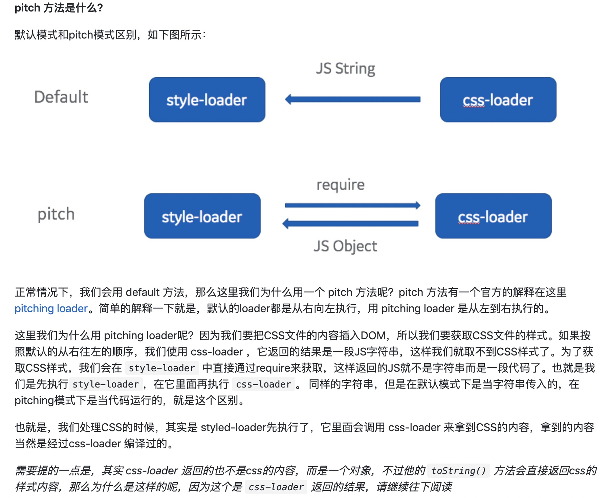

# webpack 简单loader开发

## 本文主要记录如何简单开发loader
1. loader的开发
2. loader的调试
3. loader的使用
## loader的行内模式
```js
import a from 'raw-loader!../../utils.js'
```
表示utils.js使用raw-loader处理，那么a会是该loader的返回值

## 什么是loader
loader 用于对模块的源代码进行转换。loader 可以使你在 import 或"加载"模块时预处理文件。因此，loader 类似于其他构建工具中“任务(task)”，并提供了处理前端构建步骤的强大方法。loader 可以将文件从不同的语言（如 TypeScript）转换为 JavaScript 或将内联图像转换为 data URL。loader 甚至允许你直接在 JavaScript 模块中 import CSS文件！

更多请参考[官方地址](](https://webpack.docschina.org/concepts/loaders#configuration))

## 环境
1. webpack、vscode、chrome、vue环境

## 本质
- 所谓 loader 只是一个导出为函数的 JavaScript 模块。
- 第一个 loader 的传入参数只有一个：资源文件(resource file)的内容

```js
module.exports = function(source, options){
	return source
}
```
实际上这是个完整的loader只是没有做任何事而已

## 过程
1. 我们需要新建一个文件夹类似fast-vue-md-loader
2. npm init 新增package.json环境（注意这里我们的 "name": "fast-vue-md-loader" 将是我们使用的loader名称）
3. 本地开发的引用方式loader无法相对引入而是通过npm link 链接的方式
 - 首先在loader文件夹执行（前提是package.json配置完整）**npm link**（目的是将该开发模块链接到全局，方便引用）
 -之后再本地的使用项目也就是我们需要用到loader的项目执行 **npm link loader-name**(这里的loader-name就是我们开发目录的*fast-vue-md-loader*)
 - 现在就可以使用上我们自己开发的loader了，就跟使用全局一样
 - 当然也可以使用一下api

```js  
// 跟上面的效果是一致的
resolveLoader: {
    alias: {
      'vue-loader': require.resolve('../lib')
    }
  }
  ```
 - 以下是上面fast-vue-md-loader的使用案例
 ```js
 {
        test: /\.md/,
        loader: 
          'vue-loader!fast-vue-md-loader'
      },
 ```

## 调试
### vscode的调试
在vscode环境下调试webpack的插件比较无脑
1. 首先先添加配置文件launch.json然后修改成以下路径
```json
{
	"version": "0.2.0",
	"configurations": [
		{
			"type": "node",
			"request": "launch",
			"name": "Launch Program",
			"cwd": "${workspaceFolder}",
			"program": "${workspaceFolder}/node_modules/webpack/bin/webpack.js"
		}
	]
}
```
***特别强调这里貌似vscode默认只认识webpack.config.js其他文件名称它不识别***

2. 接下来在你的本地loader中打断点，那么代码就会停留在该地方


## pitch 

[参考链接](https://github.com/lihongxun945/diving-into-webpack/blob/master/3-style-loader-and-css-loader.md)
